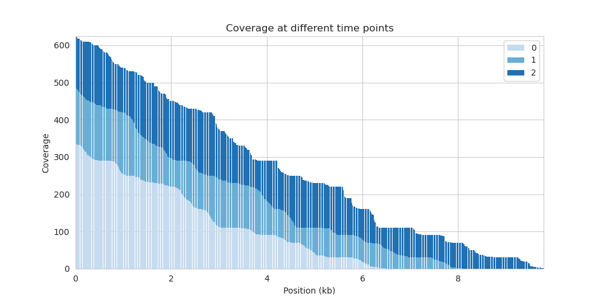
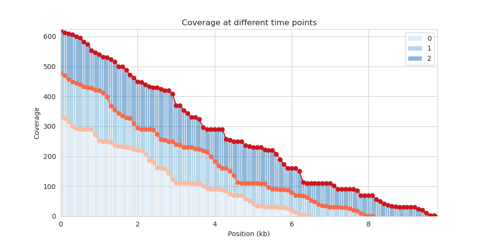
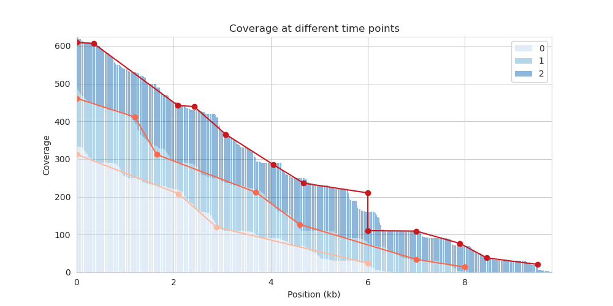

# Implementation of piecewise lineear regression 
This repository shows my ```pytorch``` implementation of fixed-breaks piecewise linear regression. I was doing research in estimating RNA elongation rates, and one essential step in the algorithm the estimation task is to precisely regress the read coverage for a gene. I looked around for different implementations of piecewise linear regression, but I could not find any that specifically fits my use case (where the need for precise regression is very crucial, and fast estimation is also important because each data point is a position on the gene, there are many data points). So, I tried to implement it in ```pytorch```, which is the fastest and neatest way that I know for this problem. I share this implementation here mostly for educational purposes for my own learning. If you ever get interested in this implementation and want me to modify (or me to help you modify the code), please reach out.

# Example data:
As mentioned above, the use case is to regress the read coverage given genomic positions. Details:
- Input data: genomic positions (x) and read coverage (y)
- Expected output: a list of breakpoints (px, py) of the piece-wise regression line. The data is such that we would most likely expect a decreasing regression line. We also want the most precise regression line (low-noise data).

Example data is provided in ```data/coverage_df.csv.gz```, and visualized here: 

Each color represents the read coverage at different time points during the experiment. The data is such that we would most likely expect a decreasing regression line.

# Regression procedure:
The cost function is $loss = \sum_{i=1}^{N} (y_i - f(x_i))^2 + max(0, \text{slope(px, py)})$, where $f(x)$ is the regressed value of $x$, and we also want the regression lines to have negative slope (because of the assumption that our data is decreasing). The breakpoints are defined as $px = [x_0, x_1, x_2, ..., x_M]$ and $py = [y_0, y_1, y_2, ..., y_M]$. Originally, piece-wise linear regression does not require the breakpoints are joint (i.e. it is possible that there are disjoint segments of data), but here, given the nature of my application, I enforce the breakpoints to be joint (the end of one segment is the start of the next segment).

There are two options to approach this regression problem:
1, Use a fixed number of breakpoints (M), fix $px$ and let $py$ be parameters for which we will optimize for. This assumption allows me to have a very fast, efficient and precise regression line. It drew inspirations from calculus inifity principle, where we can approximate a curve with a series of straight lines of infinitesimal length. I implemented this in ```regression/fixedX_pwlr.py```. Here is how to use it: 
```
fxlr_model = fxpwlr.PiecewiseLinearRegression(x_min=x_min, x_max=x_max, gap = regress_bin)  # initiate the model with fixed px
# regress_bin is the bin size on x-axis of the regession segments
fxlr_model.fit(X, Y)  # fit the model with data, X and Y each are tensors of shape (N,)
```
Results


There are many functionality of the object fxlr_model, such as plotting the regression line, getting the breakpoints, x_to_y, y_to_x, etc. The inferences of x_to_y and y_to_x are such that any lines on an approximate horizontal lines are not allowed and hence declared as nan. This is very useful for my application because we will eventually try to estimate the horizontal distance between two regression lines corresponding to two time points. 

2, Use a learned number of breakpoints. This implementation is done using numpy and scipy, very slow, and I do not have plans to transfer it to ```pytorch``` unless requested. It is implemented in ```regression/piecewise_linear_regression.py```. Here is how to use it: 
```
pwlr_model = pwlr.PiecewiseLinearRegression()
pwlr_model.fit(X, Y)
```
Results:

There are, again, many functionalities of the object pwlr_model, such as plotting the regression line, getting the breakpoints, x_to_y, y_to_x, etc. I do not have time yet to write down all documentation, but I will do it attracts interest.

# Installation:
Here are the packages that I used in this implementation. I do not have time to package this into a pip package, but I will do it if there is interest.
```
- numpy
- scipy
- torch
- pandas
- matplotlib
- seaborn
```

# Conclusion:
This is my attempt at learning about how to do optimization using ```pytorch``` for a particular application very specific to my current research in RNA elongation rate estimation. I have used many different packages for this particular problem, but I found ```pytorch``` to be fastest and most accurate. If you ever find yourself in stuations where you want joint-breakpoint piecewise linear regression, maybe this repository can help you, and if there are features you like implemented, please let me know. 


